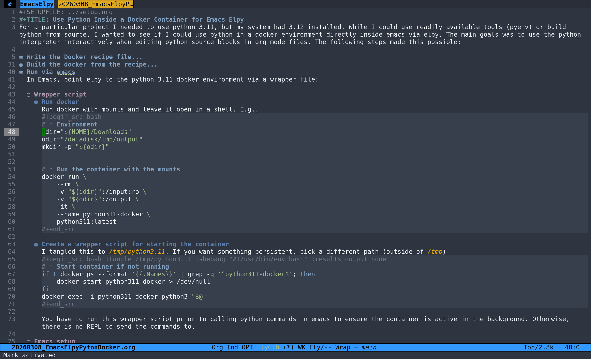

#+SETUPFILE: ../setup.org
#+TITLE: Use Python Inside a Docker Container for Emacs Elpy
For a particular project I needed to use python 3.11, but my system had 3.12 installed. While I could use readily available tools (pyenv) or build python from source, I wanted to see if I could use python in a docker environment directly inside emacs via elpy. The main goals was to use the python interpreter interactively when editing python source blocks in org mode files. The following steps made this possible:

* Write the Docker recipe file
I tangled the recipe to ~/tmp/dockerfile_python311~.

#+begin_src python :tangle /tmp/dockerfile_python311
# * Use the Python 3.11 slim image
FROM python:3.11-slim

# * Set the working directory
WORKDIR /app

# * Upgrade pip and install packages inside the container
RUN python -m pip install --upgrade pip \
    && pip install \
    numpy \
    scipy \
    nibabel \
    nilearn \
    neuromaps \
    templateflow \
    scikit-learn \
    ipython

# * Start Python REPL
CMD ["python3"]
#+end_src

* Build the docker from the recipe
#+begin_src bash
docker \
    build \
    -t python311 \
    -f /tmp/dockerfile_python311 \
    .
#+end_src

* Run via emacs
In Emacs, point elpy to the python 3.11 docker environment via a wrapper file:

** Wrapper script
*** Run docker
Run docker with mounts and leave it open in a shell. E.g.,
#+begin_src bash
# * Environment
idir="${HOME}/Downloads"
odir="/datadisk/tmp/output"
mkdir -p "${odir}"

# * Run the container with the mounts
docker run \
    --rm \
    -v "${idir}":/input:ro \
    -v "${odir}":/output \
    -it \
    --name python311-docker \
    python311:latest
#+end_src

*** Create a wrapper script for starting the container
I tangled this to ~/tmp/python3.11~. If you want something persistent, pick a different path (outside of ~/tmp~)
#+begin_src bash :tangle /tmp/python3.11 :shebang "#!/usr/bin/env bash" :results output none
# * Start container if not running
if ! docker ps --format '{{.Names}}' | grep -q '^python311-docker$'; then
    docker start python311-docker > /dev/null
fi
docker exec -i python311-docker python3 "$@"
#+end_src

You have to run this wrapper script prior to calling python commands in emacs to ensure the container is active in the background. Otherwise, there is no REPL to send the commands to.

** Emacs setup
Run the following to ensure that the python REPL from the docker is used.
#+begin_src elisp :results output none
(setq python-shell-interpreter "/tmp/python3.11")
(setq python-shell-interpreter-args "-i")
#+end_src

Now I was able to run the desired python configuration inside emacs. To me, this feels much cleaner than having to switch between system wide python versions or building python from source.

** Example
#+caption: Running Python via Docker with elpy in emacs example
#+attr_org: :width 300px
#+attr_html: :width 800px

