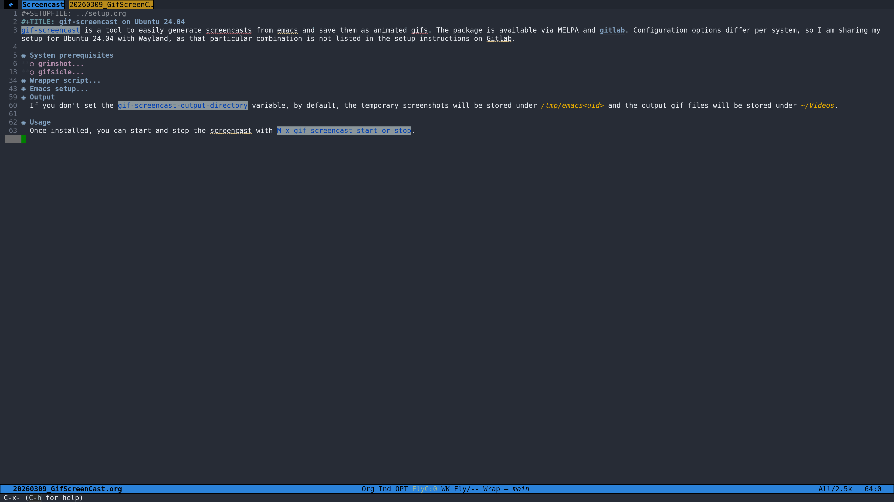

#+SETUPFILE: ../setup.org
#+TITLE: gif-screencast on Ubuntu 24.04
=gif-screencast= is a tool to easily generate screencasts from emacs and save them as animated gifs. The package is available via MELPA and [[https://gitlab.com/ambrevar/emacs-gif-screencast][gitlab]]. Configuration options differ per system, so I am sharing my setup for Ubuntu 24.04 with Wayland, as that particular combination is not listed in the setup instructions on Gitlab.

* System prerequisites
** grimshot
The Gitlab instructions mention that you can use flameshot for creating the initial screenshots. Because I already use grimshot, and because I don't feel the need to have multiple tools for generating screenshots on my system, I set up grimshot, which can be installed with:

#+begin_src bash
sudo apt-get install grimshot
#+end_src

** gifsicle
=gifsicle= is an optional tool for =gif-screencast= that optimizes the gif file. If you don't install it, =gif-screencast= will still run and produce a gif output, but it will give a warning. =gisicle= was not available via my package manager, but can be build from source ([[https://github.com/kohler/gifsicle][github]]):

#+begin_src bash
# * Enviornment
cd "${HOME}/Software" || exit
mkdir -p "${HOME}/Software"

# * Git clone
git clone https://github.com/kohler/gifsicle.git

# * Build
cd "${HOME}/Software/gifsicle" || exit
autoreconf -i
./configure
make
sudo make install
#+end_src

* Wrapper script
The following wrapper script around grimshot will be called by =gif-screencat= every time you switch a buffer/window to create a screenshot:

#+begin_src bash :tangle /path/to/grimshot_screencast :shebang "#!/usr/bin/env bash"
/usr/bin/grimshot save active "${1}"
#+end_src

Save this script and make it executable, e.g., src_bash{chmod +rx /path/to/grimshot_screencast}.

* Emacs setup
Make sure to point the =gif-screencast-program= variable to the wrapper script.

#+begin_src elisp
(use-package gif-screencast
  :ensure t
  :config
  (setq
   gif-screencast-program "/path/to/grimshot_screencast"
   gif-screencast-args '()
   gif-screencast-convert-program "convert"
   gif-screencast-scale-factor 1.5
   gif-screencast-output-directory "/output/folder")
  )
#+end_src

* Output
If you don't set the =gif-screencast-output-directory= variable, by default, the temporary screenshots will be stored under ~/tmp/emacs<uid>~ and the output gif files will be stored under ~~/Videos~.

* Usage
Once installed, you can start and stop the screencast with =M-x gif-screencast-start-or-stop=.

* Example
#+caption: gif-screencast example
#+attr_org: :width 300px
#+attr_html: :width 800px

